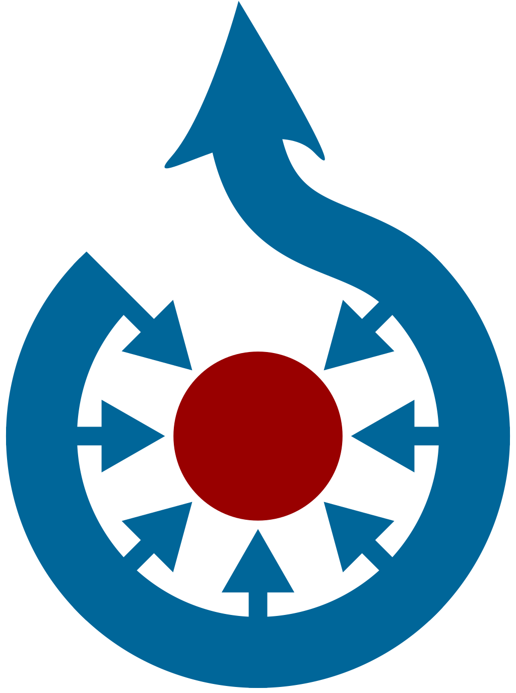

<div align="center">



# Commons Media

Hand-picked Wikimedia Commons SVG files.

</div>

## About

The purpose is to use it as image on GitHub README or blog.

## Content

### Wikimedia Commons Logo


```

```

```

```

### Microsoft .NET Logo


```

```

```

```

### Python Logo No Text


```

```

```

```

### Homebrew package manager Logo


```

```

```

```

### C Programming Language Logo


```

```

```

```

### C++ Programming Language Logo


```

```

```

```

### Xamarin Logo


```

```

```

```

### Java Logo


```

```

```

```

### PHP Logo


```

```

```

```

### libGDX Logo


```

```

```

```

### Windows Terminal Logo


```

```

```

```

### Google Chrome


```

```

```

```
